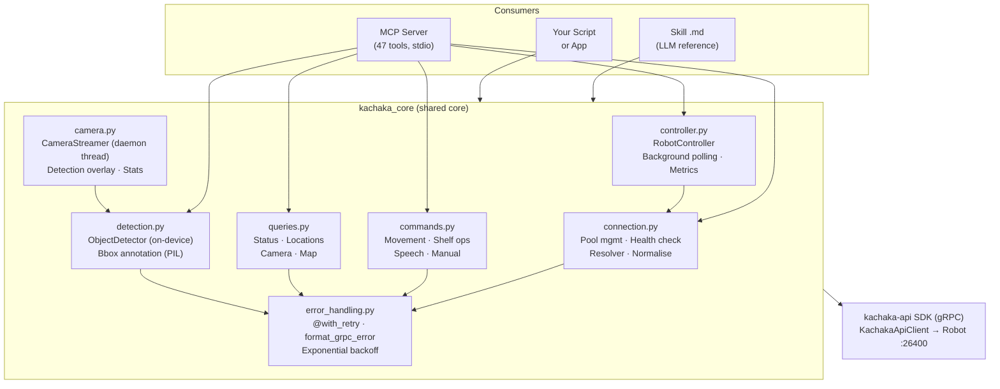
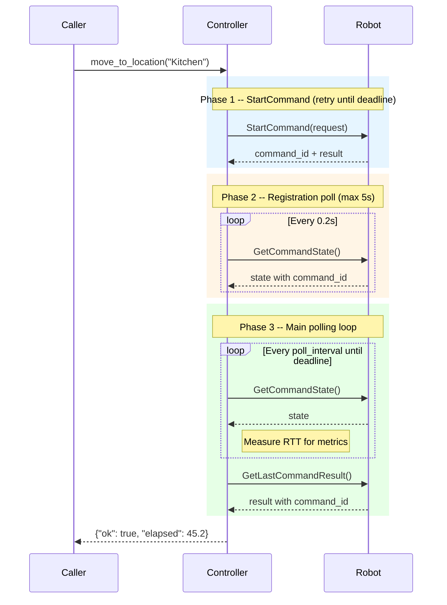
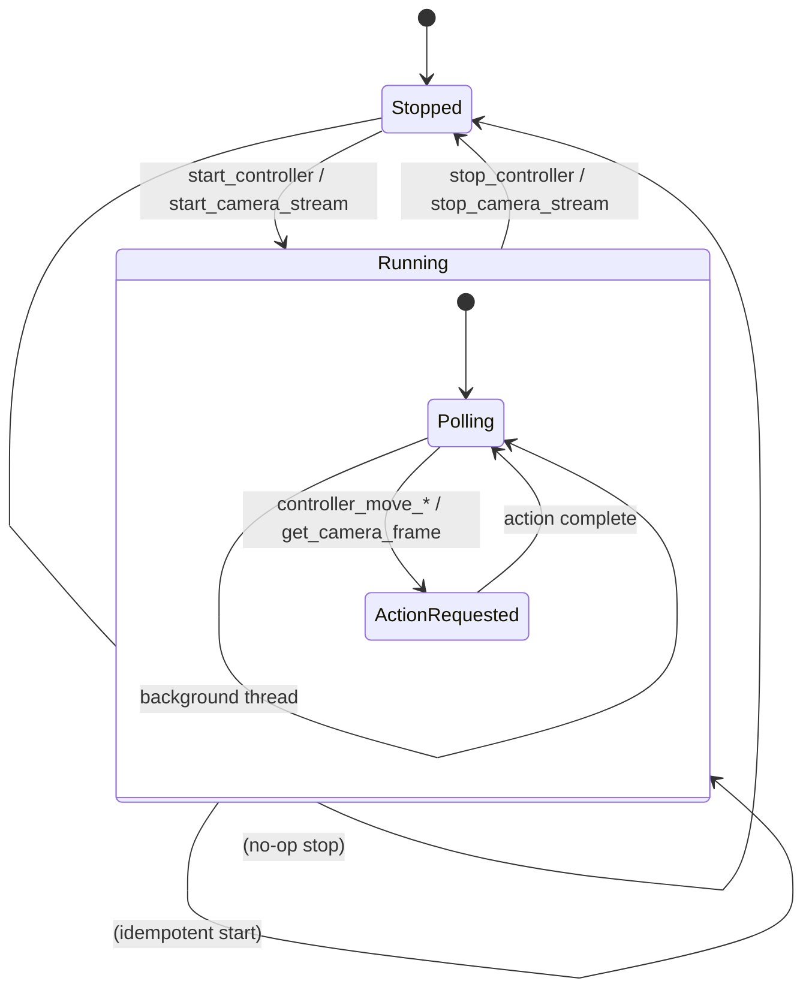
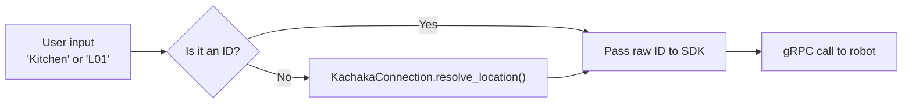
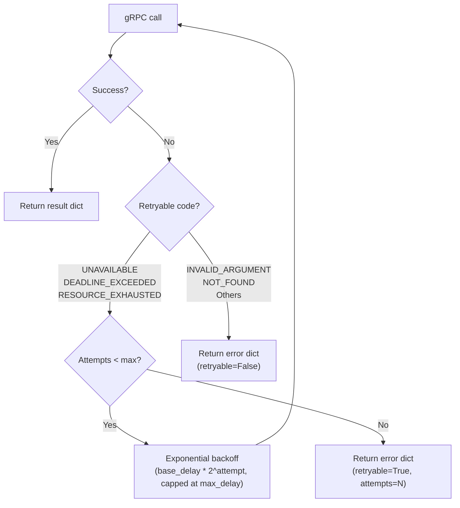
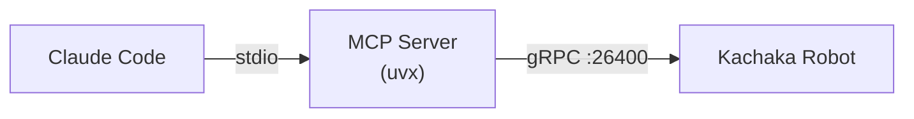
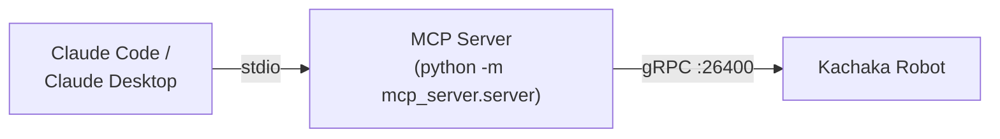
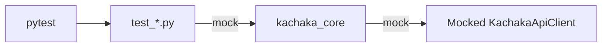

# Architecture

This document describes the internal architecture of `kachaka-sdk-toolkit`. For quick-start instructions, see [README.md](README.md).

## System Overview

The toolkit is a layered wrapper around the [kachaka-api](https://github.com/pf-robotics/kachaka-api) gRPC SDK for Kachaka robots. It provides three consumer-facing surfaces -- an MCP Server, a Skill document, and a direct Python API -- all sharing a single core library (`kachaka_core`).

The design goal is **one code path for all consumers**. The MCP Server's 47 tools are thin one-liner delegations to `kachaka_core`, so behaviour tested through the Python API is identical to behaviour observed through the MCP Server.



## Component Breakdown

### kachaka_core/connection.py -- Connection Management

**Purpose**: Thread-safe pooled gRPC connection manager and name-to-ID resolver.

**Key responsibilities**:
- `KachakaConnection.get(ip)` returns a cached, thread-safe connection. Same IP always yields the same instance (normalised with `_normalise_target()`).
- `ping()` tests connectivity and returns serial + pose.
- `ensure_resolver()` initialises the name-to-ID mapping tables (idempotent).
- `resolve_location(name_or_id)` and `resolve_shelf(name_or_id)` translate human-readable names into gRPC IDs. All resolution happens in this layer, **not** in the upstream SDK's resolver.

**Internal dependencies**: `error_handling.py` (`@with_retry`, `format_grpc_error`).

**External dependencies**: `kachaka_api.KachakaApiClient`.

### kachaka_core/commands.py -- Robot Commands

**Purpose**: All write/action operations on the robot.

**Key responsibilities**:
- Movement: `move_to_location`, `move_to_pose`, `move_forward`, `rotate_in_place`, `return_home`
- Shelf ops: `move_shelf`, `return_shelf`, `dock_shelf`, `undock_shelf`, `reset_shelf_pose`
- Speech: `speak`, `set_speaker_volume`
- Control: `cancel_command`, `proceed`, `set_manual_control`, `set_velocity`, `stop`
- `poll_until_complete(timeout)` blocks until the current command finishes.

**Internal dependencies**: `connection.py` (for `KachakaConnection`), `error_handling.py` (`@with_retry`).

**Data flow**: Caller -> `KachakaCommands` method -> name resolution via `KachakaConnection.resolve_*()` -> SDK gRPC call -> structured `dict` response.

### kachaka_core/queries.py -- Read-only Queries

**Purpose**: All read-only status and data retrieval operations.

**Key responsibilities**:
- Status: `get_status`, `get_pose`, `get_battery`, `get_errors`, `get_serial_number`, `get_version`
- Assets: `list_locations`, `list_shelves`, `get_moving_shelf`, `list_shortcuts`, `get_history`
- Camera: `get_front_camera_image`, `get_back_camera_image`
- Map: `get_map`, `list_maps`
- Command: `get_command_state`, `get_last_command_result`, `get_speaker_volume`

**Internal dependencies**: `connection.py`, `error_handling.py`.

### kachaka_core/error_handling.py -- Retry and Error Formatting

**Purpose**: Centralised error handling for all gRPC operations.

**Key responsibilities**:
- `@with_retry(max_attempts, base_delay, max_delay)` decorator with exponential backoff for transient gRPC errors (UNAVAILABLE, DEADLINE_EXCEEDED, RESOURCE_EXHAUSTED).
- `format_grpc_error(exc)` converts gRPC exceptions into structured dicts.
- Non-retryable errors (INVALID_ARGUMENT, NOT_FOUND) fail immediately.

**Data flow**: Every `@with_retry`-decorated method produces `{"ok": True, ...}` on success or `{"ok": False, "error": "...", "retryable": ...}` on failure.

### kachaka_core/camera.py -- Camera Streaming

**Purpose**: Background daemon thread for continuous JPEG capture.

**Key responsibilities**:
- `CameraStreamer(conn, interval, camera, detect, annotate)` captures frames on a configurable interval.
- `latest_frame` property provides thread-safe access to the most recent frame.
- Optional detection overlay via `ObjectDetector` when `detect=True`.
- `stats` property tracks `total_frames`, `dropped`, `drop_rate_pct`.

**Internal dependencies**: `detection.py` (when `detect=True`).

**Threading model**: Single daemon thread. `start()` on an already-running streamer is a no-op. Errors in capture increment the `dropped` counter but never crash the thread.

### kachaka_core/detection.py -- Object Detection

**Purpose**: Wraps the on-device detector and provides bounding-box annotation.

**Key responsibilities**:
- `ObjectDetector(conn)` wraps the robot's built-in detector (person, shelf, charger, door).
- `get_detections()` returns detection results with label, score, ROI, and distance.
- `capture_with_detections(camera)` combines a camera capture with detection.
- `annotate_frame(jpeg_bytes, objects)` draws bounding boxes using PIL.

**Internal dependencies**: `connection.py`, `error_handling.py`.

### kachaka_core/controller.py -- Robot Controller

**Purpose**: Background state polling + non-blocking command execution with `command_id` verification. Designed for multi-step patrols with metrics collection.

**Key responsibilities**:
- Background thread continuously reads pose, battery, and command state.
- `move_to_location`, `return_home`, `move_shelf`, `return_shelf` execute with deadline-based retry and `command_id` verification.
- `ControllerMetrics` collects poll RTT, success/failure counts.
- Shelf drop monitoring: `move_shelf` auto-starts monitoring, `return_shelf` auto-stops.

**Internal dependencies**: `connection.py` (for `KachakaConnection` and name resolution).

**Threading model**: Single daemon thread for state polling. `_execute_command` is **not** thread-safe -- callers must serialise command execution.

**Command execution flow**:



### mcp_server/server.py -- MCP Server

**Purpose**: Expose `kachaka_core` as 47 MCP tools over stdio transport.

**Key responsibilities**:
- Each `@mcp.tool()` function is a thin delegation to `kachaka_core`.
- Module-level `_streamers: dict[str, CameraStreamer]` manages camera streaming lifecycles.
- Module-level `_controllers: dict[str, RobotController]` manages controller lifecycles.
- `_streamer_key(ip, camera)` and `_controller_key(ip)` normalise keys via `KachakaConnection._normalise_target()`.

**Lifecycle patterns**: Both camera streaming and controller tools follow the same pattern:



**Tool categories** (47 total):

| Category | Count | Core module |
|----------|-------|-------------|
| Connection | 2 | `connection.py` |
| Status Queries | 6 | `queries.py` |
| Locations and Shelves | 3 | `queries.py` |
| Movement | 5 | `commands.py` |
| Shelf Operations | 5 | `commands.py` |
| Speech | 3 | `commands.py` / `queries.py` |
| Command Control | 2 | `commands.py` / `queries.py` |
| Camera | 6 | `camera.py` / `queries.py` |
| Object Detection | 2 | `detection.py` |
| Controller | 6 | `controller.py` |
| Map | 2 | `queries.py` |
| Other | 5 | `commands.py` / `queries.py` |

## Data Model

### Unified Response Format

Every method across the entire toolkit returns a `dict` with an `ok` key:

```python
# Success
{"ok": True, "action": "move_to_location", "target": "Kitchen"}

# gRPC failure (retryable)
{"ok": False, "error": "UNAVAILABLE: connection refused", "retryable": True, "attempts": 3}

# gRPC failure (non-retryable)
{"ok": False, "error": "INVALID_ARGUMENT: unknown location", "retryable": False}

# Robot error (enriched with firmware description)
{"ok": False, "error_code": 10253, "error": "error_code=10253: No destinations registered"}

# Controller timeout
{"ok": False, "error": "TIMEOUT", "timeout": 120}

# Controller not started (MCP tools only)
{"ok": False, "error": "controller not started"}
```

### RobotState (controller.py)

Snapshot dataclass updated by the background polling thread:

| Field | Type | Update cycle |
|-------|------|-------------|
| `battery_pct` | `int` | slow (30s) |
| `pose_x` | `float` | fast (1s) |
| `pose_y` | `float` | fast (1s) |
| `pose_theta` | `float` | fast (1s) |
| `is_command_running` | `bool` | fast (1s) |
| `last_updated` | `float` | fast (1s) |
| `moving_shelf_id` | `str | None` | fast (when monitoring) |
| `shelf_dropped` | `bool` | fast (when monitoring) |

### ControllerMetrics (controller.py)

Collected during `_execute_command` polling:

| Field | Type | Description |
|-------|------|-------------|
| `poll_rtt_list` | `list[float]` | RTT in ms for each successful poll |
| `poll_count` | `int` | Total poll attempts |
| `poll_success_count` | `int` | Successful polls |
| `poll_failure_count` | `int` | Failed polls |

## Name Resolution

Name-to-ID resolution is owned entirely by `KachakaConnection`, not the upstream SDK:



- `ensure_resolver()` fetches the location/shelf list from the robot and builds internal lookup tables.
- `resolve_location(name_or_id)` and `resolve_shelf(name_or_id)` are called by both `KachakaCommands` and `RobotController` before issuing gRPC commands.
- The SDK's own `update_resolver()` is **never** called.

## Configuration

### Connection Normalisation

IP addresses are normalised via `KachakaConnection._normalise_target()`:
- `"192.168.1.100"` becomes `"192.168.1.100:26400"` (default gRPC port appended)
- `"192.168.1.100:26400"` is unchanged
- This ensures the connection pool never creates duplicate entries for the same robot.

### RobotController Parameters

| Parameter | Default | Description |
|-----------|---------|-------------|
| `fast_interval` | 1.0s | Pose + command state poll interval |
| `slow_interval` | 30.0s | Battery poll interval |
| `retry_delay` | 1.0s | Delay between StartCommand retries |
| `poll_interval` | 1.0s | Delay between GetCommandState polls |

### Retry Configuration

| Parameter | Default | Description |
|-----------|---------|-------------|
| `max_attempts` | 3 | Maximum retry attempts |
| `base_delay` | 1.0s | Initial backoff delay |
| `max_delay` | 10.0s | Maximum backoff delay |

## Error Handling and Recovery

### Retry Strategy



### Error Enrichment

Both `KachakaCommands` and `RobotController` enrich error responses with human-readable descriptions from the robot firmware:

1. On command failure, the error code is extracted from the result.
2. `get_robot_error_code()` is called to fetch all known error definitions.
3. The matching description is appended: `"error_code=10253: No destinations registered"`.
4. If the fetch fails, the error code alone is returned (graceful fallback).

### Controller Error Patterns

| Scenario | Behaviour |
|----------|-----------|
| Command B cancels A | A receives `error_code=10001` (interrupted) |
| Concurrent commands | One wins, other gets TIMEOUT |
| gRPC failure during poll | `poll_failure_count` incremented, polling continues |
| State poll failure | Logged at DEBUG, thread continues |
| Shelf dropped during move | `shelf_dropped` flag set, callback fired |

## Deployment Architecture

### Claude Code Plugin (primary)



Installed via the plugin marketplace:
```
/plugin marketplace add Sigma-Snaken/kachaka-sdk-toolkit
/plugin install kachaka
```

### Local Development



Installed via:
```bash
git clone https://github.com/Sigma-Snaken/kachaka-sdk-toolkit.git
cd kachaka-sdk-toolkit
pip install -e .
kachaka-setup
```

### Test Environment

All tests use `unittest.mock` to mock the gRPC layer. No live robot connection is required. The `_clean_pool` autouse fixture clears the connection pool between tests.



## Key Technical Decisions

1. **Connection pooling over per-call connections**: gRPC channel creation is expensive. `KachakaConnection.get()` caches connections by normalised IP, making repeated tool calls fast.

2. **Self-managed name resolution**: The upstream SDK's resolver has limitations. `KachakaConnection` owns the name-to-ID mapping, giving full control over resolution behaviour and error handling.

3. **Daemon threads for background work**: Both `CameraStreamer` and `RobotController` use daemon threads, so they auto-terminate when the process exits. This avoids orphaned threads in short-lived MCP sessions.

4. **Module-level dicts for MCP state**: `_streamers` and `_controllers` are module-level dictionaries in `server.py`. This is appropriate because the MCP server runs as a single process per session, and the dicts provide simple lifecycle management without a database.

5. **command_id verification**: `RobotController` verifies that `GetLastCommandResult` returns a result for the correct `command_id`. This prevents false-positive completion detection when multiple commands race.

6. **Unified response format**: Every method returns `{"ok": True/False, ...}`. This makes error handling consistent for both human callers and LLM tool consumers.

7. **Enriched error descriptions**: Error codes alone are opaque. Fetching descriptions from the robot firmware makes errors actionable without requiring a lookup table.
