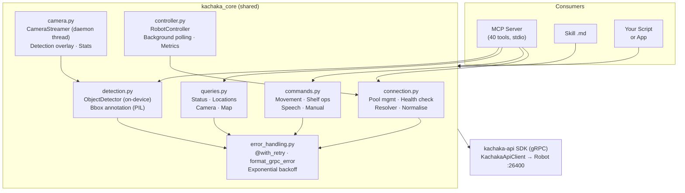
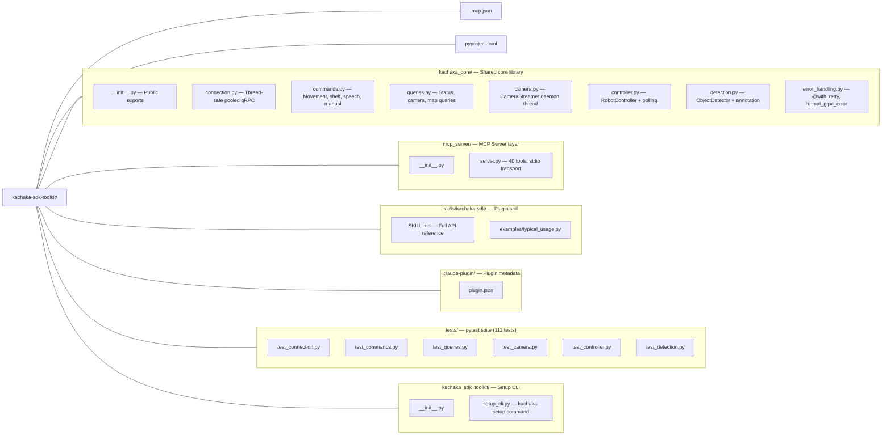

# kachaka-sdk-toolkit

A unified SDK wrapper for [Kachaka](https://kachaka.life/) robots, providing a shared core library, an MCP Server with 40 tools for AI-driven robot control, and a Skill reference document for development-time agents.

## Overview

Kachaka robots expose a gRPC API through the [kachaka-api](https://github.com/pf-robotics/kachaka-api) SDK. This toolkit wraps that SDK with production-grade infrastructure -- thread-safe connection pooling, automatic retry with exponential backoff, structured error responses, and background camera streaming -- so that every consumer (MCP Server, application scripts, patrol systems) shares the same battle-tested code path.

The project follows a layered architecture: a core library (`kachaka_core`) handles all robot communication, while the MCP Server and Skill document are thin layers on top.

## Architecture



## Features

- **Connection pooling** -- `KachakaConnection.get(ip)` returns a cached, thread-safe connection. Same IP always yields the same instance.
- **Automatic retry** -- Transient gRPC errors (UNAVAILABLE, DEADLINE_EXCEEDED, RESOURCE_EXHAUSTED) are retried with exponential backoff. Non-retryable errors fail immediately.
- **Unified response format** -- Every method returns `{"ok": True, ...}` or `{"ok": False, "error": "...", "retryable": ...}`.
- **Name + ID resolver** -- Commands accept location/shelf names or IDs interchangeably. The resolver patches the upstream SDK to support both.
- **Background camera streaming** -- `CameraStreamer` runs a daemon thread for continuous JPEG capture without blocking the main loop. Optional detection overlay draws bounding boxes on frames.
- **Object detection** -- `ObjectDetector` wraps the on-device detector (person, shelf, charger, door) and can annotate frames with bounding boxes via PIL.
- **Enriched error messages** -- Failed commands include human-readable error descriptions fetched from the robot firmware.
- **MCP Server** -- 40 tools exposing the full API surface to Claude Desktop, Claude Code, or any MCP client.
- **Skill document** -- A self-contained reference (`skills/kachaka-sdk/SKILL.md`) for development-time LLM agents.

## Tech Stack

| Component | Version |
|-----------|---------|
| Python | >= 3.10 |
| kachaka-api | >= 3.10 |
| grpcio | >= 1.66 |
| mcp[cli] | >= 1.0 |
| pytest | >= 9.0 (dev) |
| pytest-mock | >= 3.15 (dev) |
| Build system | setuptools >= 68 |
| Package manager | uv |

## Getting Started

### Prerequisites

- Python 3.10 or later
- [uv](https://docs.astral.sh/uv/) (recommended) or pip
- A Kachaka robot accessible on the network (default gRPC port: 26400)

### Installation

#### Option A: Claude Code Plugin (recommended)

```bash
/plugin marketplace add Sigma-Snaken/kachaka-sdk-toolkit
/plugin install kachaka
```

This installs the MCP server and skill automatically via `uvx` -- no local clone needed.

#### Option B: Local Development

```bash
git clone https://github.com/Sigma-Snaken/kachaka-sdk-toolkit.git
cd kachaka-sdk-toolkit
pip install -e .
kachaka-setup
```

`kachaka-setup` registers the MCP Server and Skill with Claude Code automatically. To remove:

```bash
kachaka-setup uninstall
```

For development dependencies: `pip install -e ".[dev]"`

### Quick Start

```python
from kachaka_core import KachakaConnection, KachakaCommands, KachakaQueries

# 1. Connect (port 26400 is appended automatically)
conn = KachakaConnection.get("192.168.1.100")
print(conn.ping())
# {"ok": True, "serial": "KCK-XXXX", "pose": {"x": 1.2, "y": 0.5, "theta": 0.0}}

# 2. Query robot state
queries = KachakaQueries(conn)
status = queries.get_status()
print(f"Battery: {status['battery']['percentage']}%")

locations = queries.list_locations()
for loc in locations["locations"]:
    print(f"  {loc['name']} ({loc['id']})")

# 3. Send commands
cmds = KachakaCommands(conn)
cmds.move_to_location("Kitchen")
result = cmds.poll_until_complete(timeout=60.0)
print(f"Arrived in {result['elapsed']}s")

# 4. Speak
cmds.speak("Hello, I have arrived")
```

## Core API Reference

### KachakaConnection

Thread-safe, pooled gRPC connection manager.

```python
from kachaka_core import KachakaConnection

conn = KachakaConnection.get("192.168.1.100")     # Get or create pooled connection
conn = KachakaConnection.get("192.168.1.100:26400")  # Explicit port (same instance)

conn.ping()             # -> {"ok": True, "serial": "...", "pose": {...}}
conn.ensure_resolver()  # Initialize name-to-ID resolver (idempotent)
conn.client             # Raw KachakaApiClient for direct SDK access

KachakaConnection.remove("192.168.1.100")  # Remove from pool
KachakaConnection.clear_pool()             # Drop all connections (for tests)
```

### KachakaCommands

Robot action commands. All methods return `dict` with an `ok` key. All are decorated with `@with_retry`.

| Method | Description |
|--------|-------------|
| `move_to_location(name)` | Move to a registered location by name or ID |
| `move_to_pose(x, y, yaw)` | Move to absolute map coordinates |
| `move_forward(distance_meter)` | Move forward (positive) or backward (negative) |
| `rotate_in_place(angle_radian)` | Rotate in place (positive = counter-clockwise) |
| `return_home()` | Return to charger |
| `move_shelf(shelf, location)` | Pick up shelf and deliver to location |
| `return_shelf(shelf_name="")` | Return shelf to its home location |
| `dock_shelf()` | Dock currently held shelf |
| `undock_shelf()` | Undock currently held shelf |
| `speak(text)` | Text-to-speech |
| `set_speaker_volume(volume)` | Set volume 0--10 (clamped) |
| `cancel_command()` | Cancel running command |
| `proceed()` | Resume a command waiting for confirmation |
| `set_manual_control(enabled)` | Enable/disable velocity control mode |
| `set_velocity(linear, angular)` | Send velocity (max 0.3 m/s, 1.57 rad/s) |
| `stop()` | Emergency stop -- zero velocity + disable manual control |
| `poll_until_complete(timeout)` | Block until current command finishes |

### KachakaQueries

Read-only status queries. All methods return `dict` with an `ok` key. All are decorated with `@with_retry`.

| Method | Description |
|--------|-------------|
| `get_status()` | Full snapshot: pose, battery, command state, errors, shelf |
| `get_pose()` | Current position (x, y, theta) |
| `get_battery()` | Battery percentage and power status |
| `list_locations()` | All registered locations with pose data |
| `list_shelves()` | All registered shelves with home location |
| `get_moving_shelf()` | ID of currently carried shelf (or null) |
| `get_command_state()` | Current command execution state |
| `get_last_command_result()` | Result of most recently completed command |
| `get_front_camera_image()` | Front camera JPEG as base64 |
| `get_back_camera_image()` | Back camera JPEG as base64 |
| `get_map()` | Current map as base64 PNG with metadata |
| `list_maps()` | All available maps + current map ID |
| `get_errors()` | Active error codes |
| `get_error_definitions()` | All error code definitions from firmware |
| `get_serial_number()` | Robot serial number |
| `get_version()` | Firmware version |
| `get_speaker_volume()` | Current speaker volume (0--10) |
| `list_shortcuts()` | All registered shortcuts |
| `get_history()` | Command execution history |

## CameraStreamer

Background daemon thread for continuous camera capture. Proven optimal in connection testing (30--40% lower RTT vs. inline capture, lowest drop rates).

### Basic Usage

```python
from kachaka_core import KachakaConnection, CameraStreamer

conn = KachakaConnection.get("192.168.1.100")
streamer = CameraStreamer(conn, interval=1.0, camera="front")
streamer.start()

# Non-blocking frame retrieval in your main loop
frame = streamer.latest_frame  # Thread-safe, returns latest captured dict
if frame and frame["ok"]:
    process(frame["image_base64"])  # base64-encoded JPEG
    print(f"Captured at {frame['timestamp']}")

streamer.stop()
print(streamer.stats)
# {"total_frames": 120, "dropped": 3, "drop_rate_pct": 2.5}
```

### With Callback

```python
def on_new_frame(frame: dict):
    save_to_disk(frame["image_base64"])

streamer = CameraStreamer(conn, interval=0.5, on_frame=on_new_frame)
streamer.start()
```

### Back Camera

```python
streamer = CameraStreamer(conn, camera="back")
```

### With Detection Overlay

```python
streamer = CameraStreamer(conn, interval=1.0, detect=True, annotate=True)
streamer.start()

# latest_frame now includes "objects" key + bbox drawn on image
frame = streamer.latest_frame
# {"ok": True, "image_base64": "...", "objects": [...], "timestamp": ...}

# Detection results separately
detections = streamer.latest_detections
# [{"label": "person", "label_id": 1, "roi": {...}, "score": 0.95, "distance": 2.3}, ...]
```

- `detect=True, annotate=False` -- raw frame + detection results (no bbox)
- `detect=True, annotate=True` -- annotated frame + detection results
- Default `detect=False, annotate=False` -- unchanged behavior

### Properties

| Property | Type | Description |
|----------|------|-------------|
| `latest_frame` | `dict \| None` | Most recent frame (thread-safe read) |
| `latest_detections` | `list \| None` | Most recent detection results (requires `detect=True`) |
| `is_running` | `bool` | Whether the capture thread is alive |
| `stats` | `dict` | `{total_frames, dropped, drop_rate_pct}` |

### Design Notes

- Thread is a **daemon** -- it will not prevent interpreter exit
- `stop()` signals the thread and waits up to `interval * 3` seconds
- Errors in capture increment the `dropped` counter but never crash the thread
- Detection failure never blocks frame capture (logged and skipped)
- Callback exceptions are caught and logged, never propagated
- `start()` on an already-running streamer is a no-op
- `stop()` on a non-running streamer is a no-op

## RobotController

Background state polling + non-blocking command execution with `command_id` verification. Use for multi-step patrols and metrics collection instead of `KachakaCommands`.

### Basic Usage

```python
from kachaka_core import KachakaConnection, RobotController

conn = KachakaConnection.get("192.168.1.100")
ctrl = RobotController(conn)
ctrl.start()  # starts background state polling thread

# Thread-safe state snapshot (updated every fast_interval)
state = ctrl.state
print(state.battery_pct, state.pose_x, state.pose_y, state.is_command_running)

# Non-blocking command execution with polling + command_id verification
result = ctrl.move_to_location("Kitchen", timeout=120)
# {"ok": True, "action": "move_to_location", "target": "Kitchen", "elapsed": 45.2}

result = ctrl.return_home(timeout=60)
result = ctrl.move_shelf("Shelf A", "Meeting Room", timeout=120)
result = ctrl.return_shelf("Shelf A", timeout=60)

# Metrics collected during command execution
m = ctrl.metrics
print(f"polls={m.poll_count}, avg_rtt={sum(m.poll_rtt_list)/len(m.poll_rtt_list):.1f}ms")
ctrl.reset_metrics()

ctrl.stop()
```

### Constructor Parameters

```python
ctrl = RobotController(
    conn,
    fast_interval=1.0,   # pose + command_state poll interval (seconds)
    slow_interval=30.0,   # battery poll interval (seconds)
    retry_delay=1.0,      # delay between retries on StartCommand failure
    poll_interval=1.0,    # delay between GetCommandState polls during execution
)
```

### When to Use

| Use Case | Recommended |
|----------|-------------|
| Simple one-shot command | `KachakaCommands` |
| Multi-step patrol with metrics | `RobotController` |
| Background state monitoring | `RobotController` |
| Blocking call with `@with_retry` | `KachakaCommands` |

### Command Execution Flow

The following sequence diagram shows the full `_execute_command` internal flow, which
underlies every high-level command method (`move_to_location`, `return_home`,
`move_shelf`, `return_shelf`).

```mermaid
sequenceDiagram
    participant Controller
    participant Robot

    rect rgb(230, 245, 255)
        Note over Controller, Robot: Phase 1 — StartCommand (with retry until deadline)
        loop Retry until deadline (retry_delay between attempts)
            Controller->>Robot: StartCommand(request)
            alt gRPC success
                Robot-->>Controller: command_id + result
            else gRPC failure
                Note right of Controller: Wait retry_delay, then retry
            end
        end
        alt result.success == false
            Controller->>Controller: get_robot_error_code(result)
            Note right of Controller: Return error immediately<br/>(no polling needed)
        end
    end

    rect rgb(255, 245, 230)
        Note over Controller, Robot: Phase 2 — Registration Poll (max 5s, 0.2s interval)
        loop Every 0.2s for up to 5 seconds
            Controller->>Robot: GetCommandState()
            Robot-->>Controller: state (command_id, state)
            alt Our command_id with state RUNNING or PENDING
                Note right of Controller: Registration confirmed, proceed
            else Not yet registered
                Note right of Controller: Continue polling
            end
        end
        Note over Controller: If 5s pass without confirmation:<br/>log warning but continue anyway
    end

    rect rgb(230, 255, 230)
        Note over Controller, Robot: Phase 3 — Main Polling Loop (until deadline)
        loop Every poll_interval (default 1s) until deadline
            Controller->>Robot: GetCommandState()
            Note right of Controller: Measure RTT for metrics
            Robot-->>Controller: state (command_id, state)
            alt State leaves RUNNING/PENDING OR command_id changes
                Note over Controller, Robot: Completion detected
                loop Retry
                    Controller->>Robot: GetLastCommandResult()
                    Robot-->>Controller: result (command_id, success, error_code)
                end
                alt result.command_id == our_command_id AND success
                    Note right of Controller: Return ok
                else result.command_id == our_command_id AND failure
                    Controller->>Controller: get_robot_error_code(result)
                    Note right of Controller: Return error with description
                else result.command_id != our_command_id
                    Note right of Controller: Mismatch — continue polling<br/>(our command might still be pending)
                end
            else Still RUNNING or PENDING
                Note right of Controller: Continue polling
            end
        end
    end

    rect rgb(255, 230, 230)
        Note over Controller, Robot: Phase 4 — Timeout
        Note over Controller: Deadline reached → return TIMEOUT error
    end
```



**Racing and concurrency notes:**

- **Command preemption**: If Command B is issued while Command A is still running,
  the robot cancels A. Command A's polling loop will see a completion with
  `error_code=10001` (command cancelled). When two callers race, the loser
  typically gets a `TIMEOUT` because its `command_id` is never reported as the
  current command.
- **Not thread-safe**: `_execute_command` is **not** thread-safe. Callers must
  serialise command execution externally (e.g. with a lock or sequential task queue).

## ObjectDetector

On-device object detection (person, shelf, charger, door) with optional bounding-box annotation via PIL.

### Basic Usage

```python
from kachaka_core import KachakaConnection, ObjectDetector

conn = KachakaConnection.get("192.168.1.100")
det = ObjectDetector(conn)

# Get current detections
result = det.get_detections()
# {"ok": True, "objects": [{"label": "person", "label_id": 1,
#   "roi": {"x": 100, "y": 50, "width": 200, "height": 300},
#   "score": 0.79, "distance": 2.3}, ...]}

# Capture image + detections together
result = det.capture_with_detections(camera="front")
# {"ok": True, "image_base64": "...", "format": "jpeg", "objects": [...]}

# Draw bounding boxes on raw JPEG bytes
import base64
raw = base64.b64decode(result["image_base64"])
annotated = det.annotate_frame(raw, result["objects"])
# Returns annotated JPEG bytes (not base64)
```

### Labels

| label_id | Label | Bbox Color |
|----------|-------|------------|
| 0 | unknown | pink |
| 1 | person | green |
| 2 | shelf | blue |
| 3 | charger | cyan |
| 4 | door | red |

### Notes

- `distance` is `None` when `distance_median <= 0` (close range or sensor unavailable)
- `annotate_frame` uses PIL `ImageDraw` -- does not depend on `kachaka_api.util.vision`

## MCP Server

The MCP Server exposes 40 tools for controlling Kachaka robots through any MCP-compatible client (Claude Desktop, Claude Code, etc.). Each tool is a thin one-liner delegation to `kachaka_core`.

### Running the Server

```bash
# Console entry point (preferred)
kachaka-mcp

# Or via module
python -m mcp_server.server
```

### Claude Desktop Configuration

Add to your Claude Desktop `config.json`:

```json
{
  "mcpServers": {
    "kachaka-robot": {
      "command": "python",
      "args": ["-m", "mcp_server.server"],
      "cwd": "/path/to/kachaka-sdk-toolkit"
    }
  }
}
```

### Tool Reference

All tools require an `ip` parameter (e.g., `"192.168.1.100"`). Port 26400 is appended automatically.

#### Connection (2 tools)

| Tool | Description |
|------|-------------|
| `ping_robot` | Test connectivity, return serial + pose |
| `disconnect_robot` | Remove from connection pool |

#### Status Queries (6 tools)

| Tool | Description |
|------|-------------|
| `get_robot_status` | Full snapshot (pose, battery, command, errors, shelf) |
| `get_robot_pose` | Current position (x, y, theta) |
| `get_battery` | Battery percentage + charging status |
| `get_errors` | Active error codes |
| `get_robot_info` | Serial number + firmware version |
| `get_command_state` | Whether a command is running |

#### Locations and Shelves (3 tools)

| Tool | Description |
|------|-------------|
| `list_locations` | All locations (name, id, type, pose) |
| `list_shelves` | All shelves (name, id, home location) |
| `get_moving_shelf` | Currently carried shelf ID |

#### Movement (5 tools)

| Tool | Description |
|------|-------------|
| `move_to_location` | Move to a named location |
| `move_to_pose` | Move to (x, y, yaw) coordinates |
| `move_forward` | Move forward/backward by distance |
| `rotate` | Rotate in place |
| `return_home` | Return to charger |

#### Shelf Operations (4 tools)

| Tool | Description |
|------|-------------|
| `move_shelf` | Pick up shelf, deliver to location |
| `return_shelf` | Return shelf to home |
| `dock_shelf` | Dock held shelf |
| `undock_shelf` | Undock held shelf |

#### Speech (3 tools)

| Tool | Description |
|------|-------------|
| `speak` | Text-to-speech |
| `set_volume` | Set speaker volume (0--10) |
| `get_volume` | Get current volume |

#### Command Control (2 tools)

| Tool | Description |
|------|-------------|
| `cancel_command` | Cancel running command |
| `get_last_result` | Result of last completed command |

#### Camera (6 tools)

| Tool | Description |
|------|-------------|
| `capture_front_camera` | Single JPEG from front camera (base64) |
| `capture_back_camera` | Single JPEG from back camera (base64) |
| `start_camera_stream` | Start background capture (options: `detect`, `annotate`) |
| `get_camera_frame` | Get latest frame from stream |
| `stop_camera_stream` | Stop background capture |
| `get_camera_stats` | Stream statistics (frames, drops) |

#### Object Detection (2 tools)

| Tool | Description |
|------|-------------|
| `get_object_detection` | Detect objects (person, shelf, charger, door) with scores + distances |
| `capture_with_detection` | Camera capture with detection overlay (bounding boxes) |

#### Map (2 tools)

| Tool | Description |
|------|-------------|
| `get_map` | Current map as base64 PNG |
| `list_maps` | All maps + current map ID |

#### Other (5 tools)

| Tool | Description |
|------|-------------|
| `list_shortcuts` | All registered shortcuts |
| `get_history` | Command execution history |
| `enable_manual_control` | Enable/disable velocity mode |
| `set_velocity` | Set linear + angular velocity |
| `emergency_stop` | Immediately stop robot |

## Error Handling

### Automatic Retry

All `@with_retry`-decorated methods use exponential backoff for transient gRPC errors:

| gRPC Code | Retried? |
|-----------|----------|
| `UNAVAILABLE` | Yes |
| `DEADLINE_EXCEEDED` | Yes |
| `RESOURCE_EXHAUSTED` | Yes |
| `INVALID_ARGUMENT` | No -- fails immediately |
| `NOT_FOUND` | No -- fails immediately |
| All other codes | No -- fails immediately |

Default configuration: 3 attempts, 1s base delay, 10s max delay.

### Response Format

Every method in the toolkit returns a dict:

```python
# Success
{"ok": True, "action": "move_to_location", "target": "Kitchen"}

# Failure (gRPC, non-retryable)
{"ok": False, "error": "INVALID_ARGUMENT: unknown location", "retryable": False}

# Failure (gRPC, retries exhausted)
{"ok": False, "error": "UNAVAILABLE: connection refused", "retryable": True, "attempts": 3}

# Failure (robot error with enriched description)
{"ok": False, "error_code": 10253, "error": "error_code=10253: No destinations registered"}
```

### Custom Retry Configuration

```python
from kachaka_core.error_handling import with_retry

@with_retry(max_attempts=5, base_delay=2.0, max_delay=15.0)
def my_operation(sdk):
    return sdk.some_method()
```

### Manual Error Formatting

```python
from kachaka_core.error_handling import format_grpc_error

try:
    sdk.some_method()
except grpc.RpcError as exc:
    error_dict = format_grpc_error(exc)
    # {"ok": False, "error": "UNAVAILABLE: ...", "retryable": True, "grpc_code": "UNAVAILABLE"}
```

## Testing

The test suite uses pytest with `unittest.mock` to mock all gRPC calls. No live robot connection is required.

```bash
# Run all tests
uv run pytest

# Or with pip-installed project
pytest

# Verbose output
pytest -v

# Run a specific test file
pytest tests/test_camera.py

# Run a specific test class
pytest tests/test_commands.py::TestRetry
```

### Test Coverage

| Module | Tests | Covers |
|--------|-------|--------|
| `test_connection.py` | 12 | Pool management, normalisation, ping, resolver |
| `test_commands.py` | 15 | Movement, shelf ops, speech, retry, cancel, stop, polling |
| `test_queries.py` | 13 | Status, locations, shelves, camera, map, errors, info |
| `test_camera.py` | 24 | Lifecycle, front/back capture, stats, errors, callbacks, thread safety |
| `test_controller.py` | 33 | State polling, command execution, metrics, move/shelf/return, racing conditions |
| `test_detection.py` | 14 | Detections, capture+detect, annotation, label mapping, error handling |
| **Total** | **111** | |

All tests use the `_clean_pool` autouse fixture to ensure isolation between tests.

## Project Structure



## Anti-patterns

| Don't | Do Instead |
|-------|------------|
| `KachakaApiClient(ip)` directly | `KachakaConnection.get(ip)` |
| Write your own retry logic | Use `@with_retry` decorator |
| Forget to poll command status | Use `poll_until_complete()` |
| Call camera in a tight loop | Use `CameraStreamer` for continuous capture |
| Hard-code robot IP | Pass as parameter or env var |
| Ignore `result["ok"]` | Always check before proceeding |
| Call `sdk.move_to_location()` raw | Use `cmds.move_to_location()` (handles resolver) |

## Adding New Functionality

1. Implement in `kachaka_core/commands.py` (actions) or `kachaka_core/queries.py` (read-only)
2. Add a corresponding `@mcp.tool()` in `mcp_server/server.py`
3. Update `skills/kachaka-sdk/SKILL.md`
4. Add tests in `tests/`

Example:

```python
# kachaka_core/commands.py
@with_retry()
def my_new_command(self, param: str) -> dict:
    result = self.sdk.some_sdk_method(param)
    return self._result_to_dict(result, action="my_new_command", target=param)

# mcp_server/server.py
@mcp.tool()
def my_new_command(ip: str, param: str) -> dict:
    """Description for Claude to understand when to use this tool."""
    return KachakaCommands(KachakaConnection.get(ip)).my_new_command(param)
```

## License

MIT License. Copyright 2025-present Sigma Robotics.

This project wraps the [kachaka-api](https://github.com/pf-robotics/kachaka-api) SDK. Refer to that project for SDK licensing terms.
